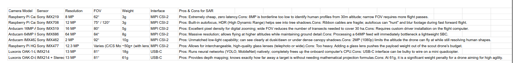

Week 0 CAD tasks: https://cad.onshape.com/documents/0179b728dd6cf5fdf34f7db9/w/5ec6f882f6f17e066df61fff/e/34a0e73822ab7b1169921801?renderMode=0&uiState=69b818e731e57fabf685e355

Week 1 CAD tasks: https://cad.onshape.com/documents/5965ec15bfa2bc3e1a299ad8/w/73ec7f2d4e9b4e7990dcfa00/e/2f9693361ea22826409942b2?renderMode=0&uiState=69c1876cfed5b8f664958f64

Drone Architecture & Frame Selection

To meet the requirements of a high-agility scout drone, the following hardware configuration has been selected. This setup prioritizes a lightweight profile, structural rigidity, and an unobstructed field of view (FOV) for Search and Rescue (SAR) operations.

Multirotor Configuration: Quadcopter
While Hexacopters and Octocopters offer motor redundancy and higher lift capacity, they require significantly larger batteries and heavier frames. For a scout drone where light-weightedness and flight endurance are the primary constraints, a Quadcopter is the most efficient choice. It offers the best thrust-to-weight ratio and simplifies the mechanical build.

Frame Geometry: The Deadcat
Within the quadcopter category, the shape of the frame dictates its utility.

-The H-Frame: The central body is a long rectangle, with arms protruding straight out from the sides.

Pros: Massive amounts of room for electronics, batteries, and large camera payloads along the central bus.

Cons: Heavier than an X-frame and slightly less structurally rigid at the arm joints during a crash.

-The True-X Frame: The motors form a perfect square, with the arms crossing at exactly 90 degrees in the center.

Pros: Perfectly balanced. The Center of Gravity (CG) and Center of Thrust (CT) are identical. Incredibly agile.

Cons: The front two propellers will constantly be in the video feed of a forward-facing camera.

Standard "True-X" frames are excellent for racing but suffer from "prop-in-view," where the propellers obstruct the camera feed. To solve this without adding the weight of a complex gimbal or a massive H-frame, we are utilizing a Deadcat Frame.

Geometry: The front arms are swept wider apart (approx. 140°) and pushed back, while the rear arms remain closer together.

Visibility: This wide-angle stance ensures that even during aggressive forward pitch, the propellers stay completely out of the camera's FOV.

Weight Efficiency: It maintains the structural rigidity of an X-frame while providing the elongated body of an H-frame for battery and electronics mounting.

Balance Note: Because the Center of Thrust is shifted rearward, the battery is positioned toward the back of the frame to keep the Center of Gravity (CG) perfectly centered.

Sensor Integration: Oblique vs. Nadir
The Choice: Oblique (45°–60°) on a Deadcat Frame An oblique angle is the requirement for SAR. It allows the operator to identify human profiles rather than just "top-of-head" blobs and provides much better depth perception when navigating 30-hectare search zones at high speeds while also being able to see the path ahead and not just scan the area which helps in obstacle avoidance.

Target Geolocation & Mathematical Offset
Since the camera is tilted at an angle (θ), the drone's GPS coordinate will not be directly over the target. To ensure accurate mapping, the system calculates the horizontal offset (d) in real-time using the drone's altitude (h) and the camera's pitch angle (θ) via the tangent projection formula: d=h⋅tan(θ)

By combining the drone’s current GPS heading with this calculated distance (d), the software automatically generates the precise coordinates of any detected object on the ground.

Material Selection
To achieve the "light-weightedness" mandate while maintaining the structural rigidity necessary for high-speed SAR operations, the drone relies on a specialized, hybrid material approach:

-Primary Airframe (Carbon Fiber): The bottom plate, top plate, and Deadcat arms are machined from 3K twill carbon fiber. Carbon fiber offers an unmatched stiffness-to-weight ratio, ensuring the frame remains rigid and free of resonance even under high thrust loads.

-Sensor Mounts (TPU): Rather than using heavy mechanical gimbals, the oblique camera housing, GPS seat, and antenna mounts are 3D printed using TPU (Thermoplastic Polyurethane). TPU is highly durable, lightweight, and natively absorbs high-frequency motor vibrations, acting as an integrated shock absorber for the camera feed.

-Fasteners & Hardware: To eliminate parasitic weight, standard steel hardware is replaced with knurled aluminum standoffs and titanium alloy screws where structural integrity allows.

Camera Selection for Area Scanning

Camera comparison table : https://docs.google.com/spreadsheets/d/157Fvjwuyvo4Nkn1HNT_8Oc1bsEw7guuEHJ5BnLttx_k/edit?usp=sharing

While the Raspberry Pi Camera V3 is the safest fallback, the Arducam 16MP Autofocus remains the superior choice for this specific architecture. It provides the exact middle-ground needed: it utilizes the low-overhead MIPI CSI-2 interface to communicate with the onboard computer, weighs practically nothing (5g), and offers double the pixel density of the standard Pi V2 camera, ensuring the detection algorithms have enough high-contrast edge data to identify targets from a 30m-40m altitude over the 30-hectare search grid.

Alternatively, if the onboard computer struggles with the OpenCV workload during initial bench testing, the Luxonis OAK-1-Lite should be documented as the immediate contingency plan, as it offloads all vision processing directly onto the camera hardware.

Motor and ESC

To maintain high agility and handle wind resistance during the scanning mission, the propulsion system needs to comfortably lift the target All-Up Weight (AUW) with a minimum 3:1 thrust-to-weight ratio while maximizing electrical efficiency. Because we selected a high-voltage 6S (22.2V) power architecture to reduce overall current draw, we must utilize a lower KV motor to prevent over-spinning and thermal overload.

The T-Motor Velox V2 2306 (1750KV) motors paired with the SpeedyBee 50A BLHeli_S 4-in-1 ESC should be utilized. The larger 2306 stator size provides the necessary low-end torque to swing 5-inch tri-blade propellers and recover from descents during grid scanning. The 1750KV variant maximizes 6S cruising efficiency (operating at roughly 2.05 g/W) while generating more than enough thrust to exceed the 3:1 ratio requirement. At 100% throttle, these motors pull a peak of 31A. The SpeedyBee 50A ESC provides a massive safety margin, easily absorbing peak current spikes without thermal throttling, ensuring absolute reliability during autonomous, continuous flights. Using a 4-in-1 layout centralizes the mass and keeps the carbon fiber arms clean to reduce aerodynamic drag.

Final Selected Battery Specifications 
Chemistry: Lithium Polymer (LiPo) 
Cell Configuration: 6S (6 Cells in Series) 
Nominal Voltage: 22.2V 
Capacity: 1300 mAh 
Discharge Rating (C-Rating): 100C Continuous 
Maximum Safe Discharge (I_max): 130 Amps 
Estimated Peak Power Output: 2,664 Watts 
Connector Type: XT60 or XT90 (depending on ESC current rating) 
